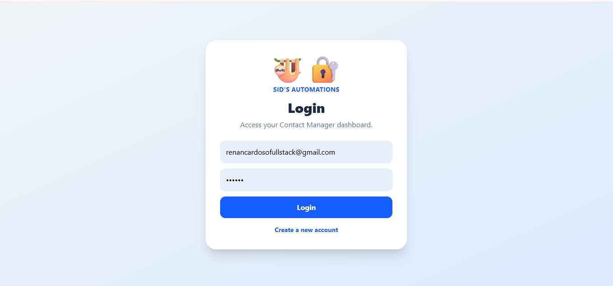
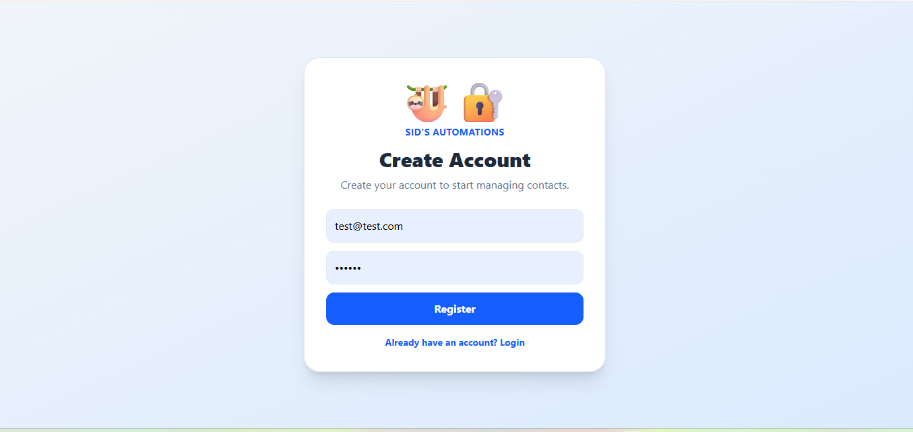
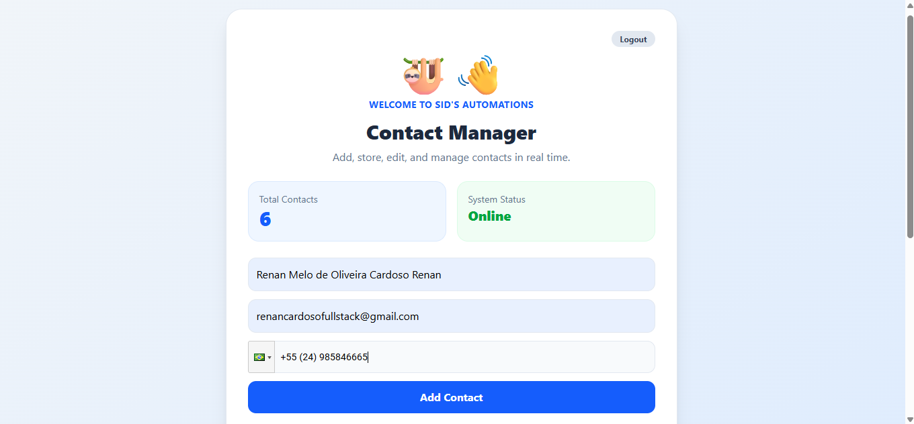

# 🚀 Sid's Automations Contact Manager


A modern Fullstack SaaS Contact Management Application built with React, Node.js, Express, MongoDB Atlas, JWT Authentication, and n8n-ready automation workflows.

---

## 🌐 Live Demo

### Frontend

https://sids-automations-contact-manager.vercel.app

### Backend API

https://sids-automations-contact-manager.onrender.com

---

## 📋 Overview

Sid's Automations Contact Manager is a modern fullstack application designed to securely manage contacts in real time.

The project was built following real-world SaaS architecture principles, including authentication, protected routes, cloud database integration, and automation-ready workflows.

This application demonstrates the complete development cycle of a production-ready Fullstack project, from frontend development to cloud deployment.

---

## 🏗 Architecture

```text
React + Vite Frontend
          │
          ▼
Node.js + Express API
          │
          ▼
MongoDB Atlas Database
          │
          ▼
n8n Automation Layer
```

---

## 🏆 Key Achievements

* Complete Fullstack CRUD Application
* JWT Authentication System
* Password Encryption with bcryptjs
* MongoDB Atlas Cloud Integration
* Protected API Routes
* User-Isolated Data Architecture
* Cloud Deployment (Render + Vercel)
* Automation-Ready Backend Structure
* Responsive User Interface
* Production Environment Configuration

---

## 📸 Screenshots

### 🔐 Login Screen

<p align="center">
  
</p>

Secure user authentication using JWT tokens.

---

### 📝 Account Registration

<p align="center">
  
</p>

Create accounts with encrypted passwords stored securely in MongoDB Atlas.

---

### 📊 Contact Management Dashboard

<p align="center">
  
</p>

Complete contact management dashboard featuring:

* Contact Creation
* Contact Editing
* Contact Deletion
* Contact Search
* Real-Time Updates
* Contact Counter Dashboard

---

## ✨ Main Features

### Authentication & Security

✅ User Registration

✅ User Login

✅ JWT Authentication

✅ Password Encryption with bcryptjs

✅ Protected Routes

✅ User-Isolated Contact Data

---

### Contact Management

✅ Create Contacts

✅ Read Contacts

✅ Update Contacts

✅ Delete Contacts

✅ Search Contacts

✅ Dashboard Statistics

✅ International Phone Number Support

---

### Database

✅ MongoDB Atlas

✅ Mongoose ODM

✅ Cloud Database Storage

---

### Deployment

✅ Vercel Frontend

✅ Render Backend

✅ MongoDB Atlas Database

---

### Automation

✅ n8n Webhook Integration

✅ Automation-Ready Architecture

---

## 🛠 Tech Stack

### Frontend

* React
* Vite
* JavaScript
* Tailwind CSS
* React Phone Input 2

### Backend

* Node.js
* Express.js
* MongoDB Atlas
* Mongoose
* JWT (jsonwebtoken)
* bcryptjs
* dotenv

### Cloud & Deployment

* Vercel
* Render
* MongoDB Atlas

### Automation

* n8n
* Webhooks

---

## 📂 Project Structure

```bash
sids-automations-contact-manager
│
├── Backend
│   ├── server.js
│   ├── package.json
│   └── .env
│
├── Frontend
│   ├── src
│   ├── public
│   └── package.json
│
├── screenshots
│   ├── login.png
│   ├── register.png
│   └── dashboard.png
│
└── README.md
```

---

## ⚙️ Installation

### Clone Repository

```bash
git clone https://github.com/renancardosofullstack/sids-automations-contact-manager.git
```

### Backend Setup

```bash
cd Backend
npm install
npm start
```

### Frontend Setup

```bash
cd Frontend
npm install
npm run dev
```

---

## 🔐 Environment Variables

Create a `.env` file inside the Backend folder:

```env
MONGO_URL=your_mongodb_connection_string
JWT_SECRET=your_secret_key
N8N_WEBHOOK_URL=your_n8n_webhook_url
```

---

## 🚀 Future Improvements

* Contact Categories
* Contact Tags
* Contact Notes
* CSV Export
* Dashboard Analytics
* WhatsApp Integration
* Email Automation
* File Upload Support
* Role-Based Access Control
* User Profiles

---

## 👨‍💻 Author

### Renan Melo de Oliveira Cardoso

Fullstack Developer focused on modern web applications, APIs, cloud deployments, and business automation.

### Skills

* React
* JavaScript
* Node.js
* Express.js
* MongoDB Atlas
* REST APIs
* JWT Authentication
* Git & GitHub
* n8n Automation

### GitHub

https://github.com/renancardosofullstack

---

## ⭐ Support

If you found this project useful, consider giving it a star.

It helps support future development and showcases the project to other developers.

---

### Built with ❤️ using React, Node.js, MongoDB Atlas and n8n.
